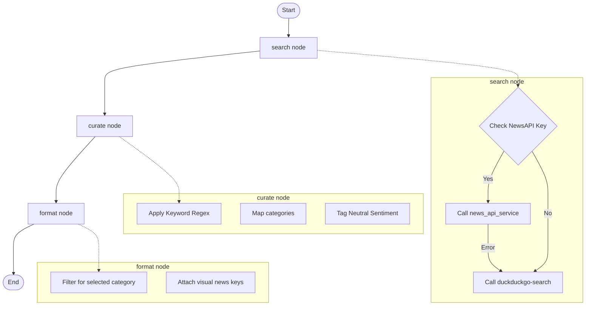

# NovaBrief — AI News Agent Project Knowledge Base

Welcome to the **NovaBrief** (also known as **AI News Agent**) Developer & Agent Knowledge Base. This document serves as the absolute single source of truth for the codebase, architecture, integration layers, APIs, data flows, and design systems of NovaBrief.

---

## 1. Core Architecture & Philosophy
NovaBrief is a modern, high-fidelity AI-curated news aggregator. Instead of simply pulling feeds and showing raw headlines, NovaBrief operates as a **synthesis pipeline**:
1. **Aggregates**: Pulls articles and search queries via `NewsAPI.org` or falling back to `DuckDuckGo News` to maintain server independence.
2. **Scrapes & Cleans**: Downloads raw HTML directly, with a fallback to Google Web Cache when encountering access restrictions ($403$/$401$), and strips headers, sidebars, scripts, ads, and navigation blocks.
3. **Categorizes & Filters**: Employs context-aware category matching and filters paywalled domains.
4. **Synthesizes & Enhances**: Uses Gemini AI models to generate concise summaries, perform high-fidelity English $\leftrightarrow$ Hindi translation, and streams spoken audio summaries back to the user via gTTS.

---

## 2. Technology Stack

### Backend
*   **Web Framework**: FastAPI (Uvicorn server) for high-performance async capabilities.
*   **AI Agent Graph**: LangGraph and LangChain to implement robust, node-based search & curation state machines.
*   **Large Language Model**: Google Gemini (`gemini-2.5-flash`) via the `langchain-google-genai` integration.
*   **Web Scraping**: BeautifulSoup4 for HTML parsing, matched with HTTPX for asynchronous, non-blocking requests.
*   **Audio Generation**: `gTTS` (Google Text-To-Speech) for text voice-over.
*   **Database**: Supabase client connection (optional) for authenticated profile syncs and user preferences storage.
*   **Platform Curation**: YouTube Data API v3 (`google-api-python-client`) for sourcing trending broadcast segments.

### Frontend
*   **Core UI Library**: React 19 + TypeScript + Vite.
*   **Styling**: Tailwind CSS (v4) for styling and grid layouts.
*   **Authentication**: Clerk Integration (`@clerk/clerk-react`) protecting personal dashboards, videos, trends, and preference configurations.
*   **Animations**: Framer Motion for premium card micro-interactions, modal transitions, and navigation layouts.
*   **Visual Assets**: Three.js-inspired soft radial patterns and custom CSS liquid morphing keyframe animations to create premium branding.

---

## 3. Directory Architecture

```
Deploy_NewsFlow/
├── .agents/                      # Workspace agent configurations & global skills
│   └── skills/                   # Modular design and optimization skillsets
├── backend/                      # Python backend server
│   ├── app/                      # Main application logic
│   │   ├── agents/               # LangGraph workflows and AI logic
│   │   │   ├── chat_agent.py     # Grounded search news chatbot assistant
│   │   │   └── news_agent.py     # State graph node workflow (DDG & NewsAPI search, filter)
│   │   ├── api/                  # Route handlers
│   │   │   └── routes.py         # REST endpoint controllers (summarize, translate, TTS, videos)
│   │   ├── core/                 # Environment configs and security filters
│   │   │   ├── config.py         # Global settings variables (Gemini/YouTube Keys, Categories)
│   │   │   ├── filtering.py      # Restricted domains paywall list and media blockers
│   │   │   └── supabase.py       # Supabase client instantiation
│   │   ├── models/               # Pydantic schemas and serialization rules
│   │   │   └── schemas.py        # Enforces type safety on requests and response data
│   │   └── services/             # Core service execution modules
│   │       ├── audio.py          # Asynchronous gTTS audio generation
│   │       ├── news_api.py       # NewsAPI query formatting client
│   │       ├── scraper.py        # Web scraper (direct request + Google cache fallback)
│   │       └── youtube_service.py # YouTube Data API v3 integration with hd, date, duration filters
│   ├── main.py                   # FastAPI server bootstrapper
│   ├── requirements.txt          # Third-party python dependencies
│   ├── schema.sql                # Supabase database table definitions
│   ├── fix_rls.sql               # Utility script disabling RLS permissions for debugging
│   └── start_server.bat          # Startup script for Windows command line
├── frontend/                     # React Single Page Application (Vite + TypeScript)
│   ├── public/                   # Public static assets
│   ├── src/                      # Source code directory
│   │   ├── components/           # Reusable graphical interface components
│   │   │   ├── ArticleEnhancer.tsx # AI modal dashboard (Summarize, Translate, Speak)
│   │   │   ├── CategoryFilter.tsx # Sliding horizontal tags filter
│   │   │   ├── ChatWidget.tsx    # Conversational floating assistant interface
│   │   │   ├── Hero3D.tsx        # Morphing liquid glass background component
│   │   │   ├── Layout.tsx        # Global page frame container
│   │   │   ├── Navbar.tsx        # Bottom/top navigation links and user button
│   │   │   ├── NewsCard.tsx      # News card featuring 3D spring hover tilt and badges
│   │   │   ├── ProtectedRoute.tsx # Clerk authentication routing gate
│   │   │   ├── SearchBar.tsx     # Custom keyword input container
│   │   │   ├── ThreeBackground.tsx # Radial dots and pulsing glowing canvas layers
│   │   │   └── VideoEnhancer.tsx # YouTube transcript summarizer modal
│   │   ├── context/              # Context providers
│   │   │   └── ThemeContext.tsx  # Light/Dark mode state sync and persistence
│   │   ├── lib/                  # Local utility definitions
│   │   │   └── utils.ts          # Conditional tailwind class merge helper
│   │   ├── pages/                # Page route components
│   │   │   ├── ArticleTools.tsx  # Dashboard page for custom URL and text AI operations
│   │   │   ├── Feed.tsx          # Main personalized dashboard
│   │   │   ├── Home.tsx          # Premium marketing landing page
│   │   │   ├── Search.tsx        # Advanced search page with date filters
│   │   │   ├── Settings.tsx      # Categories preferences manager and theme toggle
│   │   │   ├── Trends.tsx        # Top trending category views
│   │   │   └── Videos.tsx        # Live broadcast feeds page
│   │   ├── services/             # Core service execution modules
│   │   │   ├── api.ts            # Axios integration layer with backend endpoints
│   │   │   └── types.ts          # TypeScript interfaces mapping pydantic models
│   │   ├── App.css               # Component specific layout rules
│   │   ├── App.tsx               # Client route manager with lazy loaded imports
│   │   ├── index.css             # Tailwind CSS tokens, fonts, and dark mode classes
│   │   └── main.tsx              # React client entrance wrapping Clerk provider
│   ├── package.json              # Client dependencies and run script configurations
│   ├── eslint.config.js          # ESLint syntax rules configuration
│   ├── tailwind.config.js        # Content configuration matching styles
│   ├── postcss.config.js         # PostCSS plugins configurations
│   ├── tsconfig.json             # TypeScript root forwarding configuration
│   ├── tsconfig.app.json         # TypeScript configuration for application environment
│   ├── tsconfig.node.json        # TypeScript configuration for Node environment
│   ├── verify_script.py          # Playwright test verification scripting
│   └── vite.config.ts            # Vite compile setups
├── test_features.py              # Backend endpoint verification script
├── FEATURES.md                   # Summarization, Translation, TTS workflows
├── INSTALLATION.md               # Detailed setups, production deploys, and Docker scripts
├── QUICK_START.md                # Fast setup and server boots guide
├── USAGE_GUIDE.md                # Keyboard shortcuts and interactive flows
├── YOUTUBE_SETUP.md              # Google Cloud console credential configuration guide
├── UPDATE_SUMMARY.md             # Summary logs enabling actual YouTube broadcasts
├── TROUBLESHOOTING.md            # Startup, server port, API, and database RLS fixes
└── IMPLEMENTATION_SUMMARY.md     # Logs completed tasks, test checklists, and plans
```

---

## 4. End-to-End Data Flow

The diagram below details the operational data flow when a user requests an article summary:

```mermaid
sequenceDiagram
    autonumber
    actor User
    participant React as React Frontend
    participant FastAPI as FastAPI Backend
    participant Scraper as Scraper Service
    participant Gemini as Gemini 2.5 Flash
    participant WebCache as Google Cache fallback
    participant TargetWeb as Target Website

    User->>React: Click sparkle (✨) / Paste URL
    React->>FastAPI: POST /news/summarize { url }
    FastAPI->>Scraper: fetch_article_content(url)
    
    rect rgb(20, 20, 30)
        note right of Scraper: direct fetch attempt
        Scraper->>TargetWeb: GET request (stealth headers)
        alt 200 OK
            TargetWeb-->>Scraper: HTML payload
        else 403 / 401 Blocked
            note right of Scraper: Fallback mode triggered
            Scraper->>WebCache: GET cached version
            WebCache-->>Scraper: Cached HTML
        end
    end

    Scraper->>Scraper: Parse HTML, remove ads/scripts, extract body
    Scraper-->>FastAPI: Clean text block
    
    FastAPI->>Gemini: Send prompt + clean text
    Gemini-->>FastAPI: AI summary (<300 words)
    FastAPI-->>React: SummarizeResponse { title, summary }
    React-->>User: Display summary in Modal
```



---

## 5. API Reference

### 5.1 News Search
-   **Endpoint**: `POST /api/v1/news/search`
-   **Payload**:
    ```json
    {
      "query": "artificial intelligence",
      "date": "2026-07-04",
      "categories": ["Technology"],
      "limit": 15
    }
    ```
-   **Response**:
    ```json
    {
      "success": true,
      "news": [
        {
          "id": "news_0",
          "title": "AI Breakthrough in Latency Reduction",
          "summary": "Researchers achieve 40% speed improvements...",
          "source": "TechCrunch",
          "url": "https://techcrunch.com/...",
          "category": "Technology",
          "published_at": "2026-07-04T12:00:00Z"
        }
      ],
      "query": "artificial intelligence",
      "total": 1
    }
    ```

### 5.2 Summarize URL
-   **Endpoint**: `POST /api/v1/news/summarize`
-   **Payload**:
    ```json
    {
      "url": "https://www.bbc.com/news/technology-12345"
    }
    ```
-   **Response**:
    ```json
    {
      "summary": "This article discusses the new regulations in tech...",
      "title": "New Tech Regulations Imposed",
      "original_text": "London - Government boards today declared..."
    }
    ```

### 5.3 Translate Summary
-   **Endpoint**: `POST /api/v1/news/translate`
-   **Payload**:
    ```json
    {
      "text": "This article discusses the new regulations in tech...",
      "target_language": "hi"
    }
    ```
-   **Response**:
    ```json
    {
      "translated_text": "यह लेख तकनीक में नए नियमों पर चर्चा करता है...",
      "source_language": "auto"
    }
    ```

### 5.4 Text-To-Speech (TTS)
-   **Endpoint**: `POST /api/v1/news/speak`
-   **Payload**:
    ```json
    {
      "text": "This article discusses the new regulations in tech...",
      "language": "en"
    }
    ```
-   **Response**: Audio binary stream (`audio/mpeg`). Plays back in the browser using the Web Audio API.

---

## 6. AI Agent Workflows

### 6.1 LangGraph Curation Graph (`news_agent.py`)


### 6.2 Contextual Chat Grounding (`chat_agent.py`)
1.  Receives user message and chat history.
2.  Analyzes message for temporal or event terms.
3.  If present, calls `DuckDuckGoSearchResults` to retrieve top-5 results.
4.  Constructs system prompts combining the search context, chat history, and user query.
5.  Queries `Gemini-2.5-Flash` to return a grounded response with source links.

---
 
## 7. Frontend Pages — Detailed Functionality
 
### 7.1 Home Page (`Home.tsx`)
*   **Purpose**: Introduces the user to NovaBrief with a premium visual presentation.
*   **Visual Assets**: Employs a CSS-driven rotating liquid gradient sphere (`Hero3D`) and ambient pulsing blurred canvas gradients (`ThreeBackground`).
*   **Pipeline Simulator**: A dynamic, automatic console board showing live mock simulation transitions (`Ingesting Sources` $\rightarrow$ `AI Synthesis Active` $\rightarrow$ `Brief Ready`) looping every 4.5 seconds.
*   **Chat Terminal Mockup**: Demonstrates the contextual search citation capabilities of the assistant with simulated questions and grounded answers.
 
### 7.2 Feed Page (`Feed.tsx`)
*   **Purpose**: The main personalized portal aggregating live updates.
*   **Interest Preferences**: Parses `novabrief_preferences` from the user's localStorage. If interests are configured, chains queries using `OR` logic; otherwise queries generic breaking headlines.
*   **Dynamic Custom Search**: Integrates `SearchBar.tsx` allowing instant, keyword-based search queries across all configured news networks.
*   **Visual Elements**: Organizes cards in clean grids featuring custom Framer Motion page entrance effects, hover tilt movements, category labels, publication details, and custom sentiment color badges.
 
### 7.3 Trends Page (`Trends.tsx`)
*   **Purpose**: Showcases breaking stories classified under specific industry categories.
*   **Interactive Filters**: Houses horizontal-scrolling category button groups (All, General, Technology, Business, Science, Health, Entertainment, Sports). Clicking a tag sends parameters to `/news/trends/{category}`.
*   **Sentiment Tagging**: Emphasizes Positive, Negative, and Neutral classifications to support rapid feed scanning.
 
### 7.4 Videos Page (`Videos.tsx`)
*   **Purpose**: Curated hub for video broadcasts and television clips.
*   **YouTube Query API**: Pulls trending clips using category lists via `/news/videos/trending`.
*   **Search Constraints**: Restricts results to videos published in the last 7 days, with medium duration (4 to 20 minutes), and in High Definition (HD).
*   **Relevance Sorting**: Fetches statistical indicators and sorts playlists by view count. Card covers render centered Play icons prompting users to watch directly on YouTube.
 
### 7.5 Search Page (`Search.tsx`)
*   **Purpose**: Diagnostic search dashboard providing focused queries.
*   **Calendar Querying**: Couples standard text inputs with date search fields (`type="date"`), sending parameters to search APIs to locate items matching precise timelines.
 
### 7.6 AI Tools Page (`ArticleTools.tsx`)
*   **Purpose**: Unified dashboard for processing raw text and custom URLs.
*   **Direct URL Summarization**: Allows users to paste any article link. Runs Scraper and Gemini tasks to generate clean summary cards with copy-to-clipboard actions.
*   **Translation Panel**: Operates English-Hindi translations of AI outputs.
*   **Smart Reader Panel**: A text block editor connected to gTTS voice outputs. Users can enter custom text or auto-paste summaries, selecting vocal speakers to play audio streams.
 
### 7.7 Settings Page (`Settings.tsx`)
*   **Purpose**: Controls global application behavior and preferences.
*   **Theme Configuration**: Implements a smooth toggle to transition document context classes between Light Mode and Dark Mode (saving states to `novabrief_theme` in localStorage).
*   **Interest checklist**: Grid of checkboxes corresponding to settings categories. Clicking tags adds/removes items from `novabrief_preferences` in localStorage.
 
---
 
## 8. Development & Verification Processes

### 8.1 Setup Commands
Run these commands in separate terminal sessions:
 
**Backend Server Setup**
```bash
cd backend
pip install -r requirements.txt
cp .env.example .env
# Edit .env to add GOOGLE_API_KEY and YOUTUBE_API_KEY
python -m uvicorn main:app --reload --port 8000
```
 
**Frontend Dev Server Setup**
```bash
cd frontend
npm install
npm run dev
```
 
### 8.2 Verification Checklist
Use the integration tools to confirm the services are operational:
1.  **Backend Health**: Run `curl http://localhost:8000/health` (should return `{"status":"healthy"}`).
2.  **API Verification**: Run `python test_features.py` from the root directory to verify summarization, translation, and speech generation functions.
3.  **UI Pipeline Verification**: Run `python frontend/verify_script.py` to trigger headless browser checks, verifying that the dashboard, trends, and video page screens load correctly.
 
---
 
## 9. Core Working Functionality & Code Logic
 
This section outlines how the core features of the system operate programmatically under the hood.
 
### 9.1 The Stealth Scraping Pipeline (`scraper.py`)
To prevent paywalls and anti-scraping firewalls from blocking retrieval, the system implements a direct-fetch and cache fallback process:
1.  **Stealth Headers**: The client executes an HTTP request using user-agent headers resembling a full Chrome browser on Windows.
2.  **Fallback to Google Cache**: If the site returns a `403 Forbidden` or `401 Unauthorized` status error, the system automatically redirects the query:
    `http://webcache.googleusercontent.com/search?q=cache:{url}`
    Google cache strips complex authorization checks and scripts, providing access to raw static HTML.
3.  **Noisy Elements Stripping**: BeautifulSoup decomposes scripts, styles, navigations, footers, headers, sidebars, iframes, noscripts, and elements containing matching regex patterns (`sidebar`, `social`, `ad-`, `promoted`, etc.).
4.  **Target Content Parsing**: Spiders target HTML tags sequentially: `<article>` $\rightarrow$ `<main>` $\rightarrow$ common content classes (`.post-content`, `.entry-content`) $\rightarrow$ fallback to `<body>`.
 
### 9.2 LangGraph State Curation (`news_agent.py`)
To aggregate and process articles, the platform compiles a structured StateGraph:
1.  **State Schema**: Holds `query`, `categories`, `raw_search_results`, `curated_news`, `final_news`, and `error`.
2.  **Dynamic Search Node**: First tries NewsAPI.org. If the API key is missing or returns rate-limits, it switches to `duckduckgo-search` to query live items.
3.  **Fast Curation Node**: Scans title/snippet keyword dictionaries (e.g., matching "crypto", "blockchain" $\rightarrow$ `Crypto`, and "rocket", "nasa" $\rightarrow$ `Space`). This client-side categorization bypasses expensive LLM calls during core feed queries.
4.  **Straitened Formatting Node**: Filters results to ensure only items matching the user's category parameters are returned.
 
### 9.3 Grounded Chat Conversational Loop (`chat_agent.py`)
The chat widget leverages retrieval-augmented generation (RAG) to ensure accuracy:
1.  **Event Keyword Scanning**: Analyzes queries for event phrases ("latest", "news", "today", etc.).
2.  **Grounding Ingestion**: If identified, calls DuckDuckGo search in the background to scrape current event snippets.
3.  **Context-Aware Prompts**: Combines these search snippets and the last 5 turns of conversation history into a unified system prompt.
4.  **Gemini Synthesis**: Feeds parameters to the Gemini model to synthesize grounded replies accompanied by verified citation links.
 
### 9.4 Text-to-Speech (TTS) & Streams (`audio.py` & `routes.py`)
NovaBrief provides eye-free read-aloud tools:
1.  **Execution Isolation**: Runs CPU-heavy gTTS tasks in a `ThreadPoolExecutor` to keep FastAPI's event loop unblocked.
2.  **Stream Return**: Converts text blocks to voice binaries, loading them into a `BytesIO` buffer.
3.  **Immediate Playback**: Returns the buffer via FastAPI's `StreamingResponse` as an `audio/mpeg` stream. The client immediately plays it back using the browser's Web Audio API.
